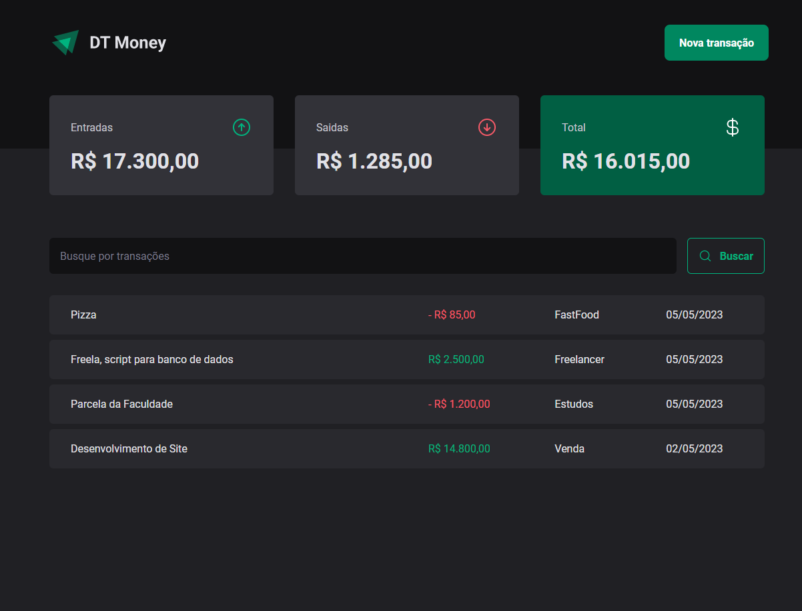

<h1 align="center">DT Money</h1>

<h4 align="center">
  ☕ Projeto desenvolvido para fins de estudo
</h4>

  

## 💻 Projeto
DT Money, é projeto que foi desenvolvido durante a trilha de especialização React do Ignite (Rocketseat), seu objetivo e realizar o controle de entradas e saídas financeiras.

## :rocket: Tecnologias

Tecnologias utilizadas no projeto:

- [React](https://react.dev/learn)
- [Styled Components](https://styled-components.com/)
- [Vite](https://vitejs.dev/)
- [Json Server](https://github.com/typicode/json-server)

## Executando o projeto
1. Execute o comando `yarn` para instalar as dependências necessárias do projeto
2. Rode o comando `yarn dev:server` para rodar a fake api
3. Rode o comando `yarn dev` para executar a aplicação

## 🤔 Como contribuir

- Faça um fork desse repositório;
- Cria uma branch com a sua feature: `git checkout -b minha-feature`;
- Faça commit das suas alterações: `git commit -m 'feat: Minha nova feature'`;
- Faça push para a sua branch: `git push origin minha-feature`.

Depois que o merge da sua pull request for feito, você pode deletar a sua branch.

---

Desenvolvido por [William José Dias!](https://github.com/WilliamWJD)
